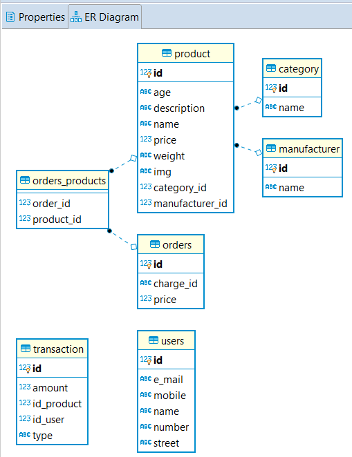

## Andriana Ilievska 163250
## Project for the Course: "Web Programming" - Faculty of Computer Science and Engineering (FINKI).

### Project info
This application is created in order to emulate a shopping website dedicated to animals, but because of the way it's being built, it can be used as an e-shop for everything.

### Startup
#### Frontend (https://github.com/Andriana95/pet-shop-react)
To start the frontend application, please open a terminal and write `npm run start`.
#### Backend (https://github.com/Andriana95/PetShop)
In order to start the application, you need to provide correct datasource information.
This is done in the `application.properties` file.

The current db is named `petShop`.

### Example:
```
spring.datasource.url=jdbc:postgresql://localhost:5432/petShop
spring.datasource.username=postgres
spring.datasource.password=admin
```
The application uses `spring.jpa.hibernate.ddl-auto=update` so that the tables will be created automatically from the domain models.

After the correct information is added, please run `DemoApplication.java`

# Pet shop Spring Boot application
This application is used by the pet shop frontend application (https://github.com/Andriana95/pet-shop-react)

### Stripe
The application also uses Stripe, and the `stripe.pk` and `stripe.sk` are stored in the `application.properties` file as well (just for demo purposes, in real life, we should send them as ENV vars)

### Application
The application will run on port 8080.

There is a `@CrossOrigin(origins = "*", allowedHeaders = "*")` for the controllers, so that we can access it from anywhere. This is for DEMO purposes only.

The ER diagram looks something like this for now:


